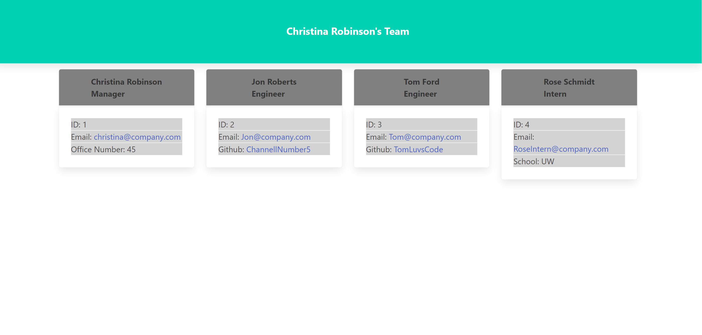

# CR-TeamProfileGenerator

## Description

This application uses node to run a series of prompts on the command line to generate your work or project team profiles. The application uses inquirer to prompt the team manager for their name, id number, email address and office number and then offers the manager a menu of choices to create profiles for the rest of the team. The manager has the option to create an Engineer profile, which includes the Engineers name, id number, email address and then the option to add their Github user name, or an Intern profile, which includes the Intern's name, id number, email address and then the option to add their school name. Once the team profiles are all created, the Manager chooses the "finish my team" menu option and the application creates a client facing webpage that rendered the employee profile cards.

Here is the screenshot of the Team Profile I built during the tutorial:

## Installation
To run this Team Profile Generator you will need to have node downloaded on your machine an then, once it is downloaded and you have cloned the repository, you will need to run an "npm install" so that you have the requisite dependencies downloaded from the package.json file.

## Usage
Check out the youtube video tutorial [here](https://www.youtube.com/watch?v=bQZ9MSfzT0Q) for how to run this application! It is run through the command line, so you will need to run "node index.js" and then follow the prompts to create your team.

## Credits
This application used [Jest](https://jestjs.io/) from npm to run the tests and then used [Inquirer](https://github.com/SBoudrias/Inquirer.js/) to run the prompts and gather the user input. Once the HTML file was created, this application used [Bulma](https://bulma.io/) as the CSS Framework.

## Tests
As stated above, this application uses Jest as the test suite for it's code. To run the tests, the user will need to enter "npm run test" into the command line and then hit enter. If install and cloning of the application was successful, it should pass all tests created during development.

## License

This project is licensed under the MIT license.

[MIT License](https://opensource.org/licenses/MIT)

## Contact Info

Christina Robinson

Email: [CLRCoding@gmail.com](mailto:CLRCoding@gmail.com)

Github: [ChannellNumber5](https://github.com/ChannellNumber5)

### Resources
- [Open Page in New Tab](https://www.freecodecamp.org/news/how-to-use-html-to-open-link-in-new-tab/)
- [MailTo: for email links](https://www.w3schools.com/tags/tag_address.asp)
- [typeof operator](https://javascriptweblog.wordpress.com/2011/08/08/fixing-the-javascript-typeof-operator/)
- [Writing CSS in HTML](https://www.w3schools.com/css/css_howto.asp)
- [Bulma CSS Framework](https://bulma.io/documentation/overview/start/)
- [Bulma Column Class Solution](https://stackoverflow.com/questions/52049767/centering-cards-with-bulma-css)